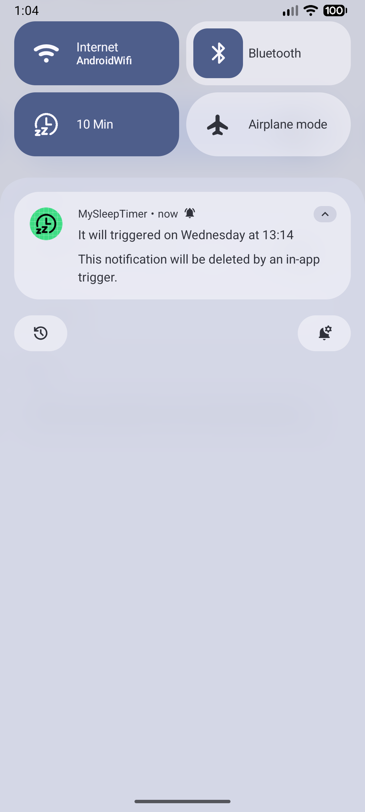

Quick Sleep Timer Tile
======================

🌙 Simple, Quick Sleep Timer for Android
----------------------------------------

The **Quick Sleep Timer Tile** is a **minimalist, set-and-forget tool** for your Quick Settings panel. It lets you set a sleep countdown in just a few taps, eliminating the need to open full apps. This conserves your **battery life** by automatically stopping media playback when you fall asleep.

✨ Features and Time Cycles
--------------------------

The app uses a fluid tile that cycles through optimized time settings:

*   **Quick Settings Tile:** Access the timer **instantly** without launching an app interface, ideal for use in the dark.

*   **Optimized Time Cycle:** Repeatedly tapping the tile cycles through practical durations:

    *   **1 Minute:**
    *   **10 Minutes:**
    *   **60 Minutes**
    *   **...**
    *   **120 Minutes**

*   **Simple Reset:** After 120 minutes, the next tap instantly resets the cycle back OFF-state and then to 1 minute.

🛠️ Critical Setup: Enabling Accessibility Service
--------------------------------------------------

**This is the single most important step for the app to stop media playback (e.g., Spotify, Youtube, Netflix, ...) when the timer expires.**

Android requires the **Accessibility Service** permission for the app to send the necessary **"Media Stop/Pause"** command to other apps. Without this one-time authorization, the timer cannot turn the screen off.

**How to Enable:**

1.  Open your device's main **Settings**.
2.  Navigate to **Accessibility**.
3.  Look for **"Installed apps"** or **"Downloaded services"**.
4.  Find and tap **"Quick Sleep Timer Tile"**.
5.  Toggle the permission **ON** and accept the security warning.

🚀 How to Use It
----------------

1.  **Add the Tile (First Time Only):**
    *   Swipe down to fully expand the Quick Settings panel.
    *   Tap the **Edit/Pencil icon** to manage your tiles.
    *   Drag the **"Sleep Timer"** tile (crescent moon/clock icon) into your active area.
2.  **Set the Timer:**
    *   Start your media (music, podcast, or audiobook).
    *   Tap the tile repeatedly until it displays your desired duration: **1 min** → **10 min** → **60 min**.
3.  **Timer Confirmation and Stop:**
    *   The tile displays the active remaining time.
    *   When the timer expires, playback ceases immediately, and the tile resets.

📸 Screenshots
--------------

